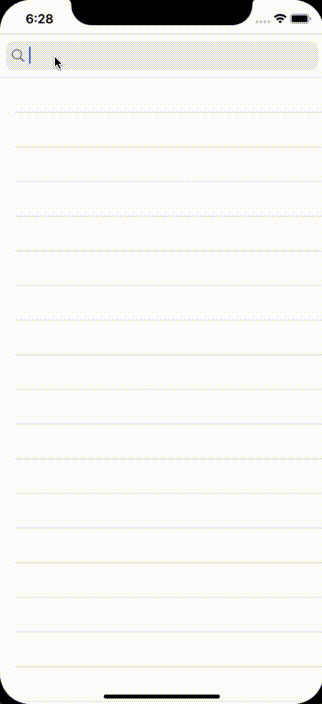

# RxSwift Examples

<center>

|Color Picker|Networking / Github issues|
|---|---|
|||

</center>

### Requirements

Swift `5.0`, iOS deployment target: `13.2`.

Cocoapods `1.9.2`.
Installed pods are included in the repository. Project runs out of the box.
In case of manual pods installation, run:

```
pod repo update
pod install
```
#### Run
Each example runs under a distinct target.